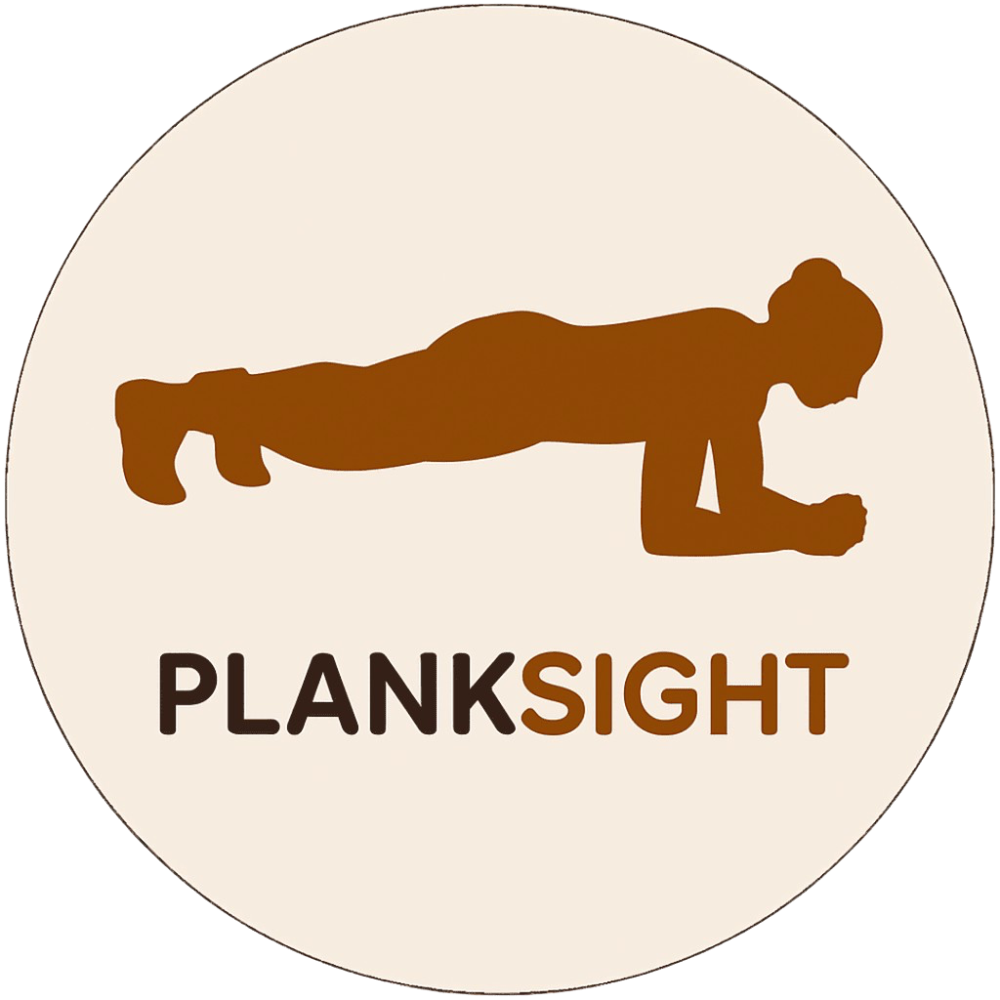

<div align="center">

  

  <h1>PlankSight</h1>

  <p>
    <strong>Aplikasi iOS untuk Deteksi &amp; Koreksi Postur Plank Secara Real-Time</strong><br/>
    Didukung Apple Vision Framework &amp; Machine Learning On-Device
  </p>

  <p>
    
    
    
    
  </p>

</div>

---

## Tentang Proyek

**PlankSight** adalah aplikasi kebugaran iOS yang memanfaatkan kamera perangkat untuk mendeteksi dan mengoreksi postur *plank* pengguna secara langsung menggunakan Apple Vision Framework. Berbeda dengan timer biasa, aplikasi ini hanya menghitung waktu saat postur terdeteksi **benar** — sehingga angka yang tercatat benar-benar mencerminkan kualitas latihan, bukan sekadar durasi.

Semua pemrosesan dilakukan **sepenuhnya di perangkat** (*on-device*) tanpa pengiriman data ke server.

---

## Fitur Utama

### Deteksi & Koreksi Postur
- **Pelacakan Sendi AI (On-Device)** — Mendeteksi hingga 17 titik sendi tubuh menggunakan `VNDetectHumanBodyPoseRequest`, lalu menyederhanakan ke sendi kunci plank (kepala, bahu, pinggul, lutut, pergelangan kaki, siku).
- **Kalibrasi Multi-Posisi** — Mendukung 4 konfigurasi kamera: portrait kiri/kanan dan landscape kiri/kanan, masing-masing dengan threshold yang disesuaikan.
- **Deteksi Kesalahan Real-Time** — Mendeteksi 4 jenis kesalahan postur secara bersamaan: pinggul terlalu rendah, pinggul terlalu tinggi, lutut tertekuk, dan kepala turun, dengan sistem debounce (2 detik untuk aktivasi, 0,45 detik untuk clear) agar feedback tidak "berkedip-kedip".
- **Pose Smoother** — Menghaluskan data sendi antar frame untuk mengurangi noise kamera.

### Timer Cerdas
- **Tiga Jam Independen** — Timer *display* (waktu dinding), timer *tracked* (hanya saat tubuh terdeteksi), dan timer *strict* (hanya saat postur benar & tanpa kesalahan aktif) bekerja secara bersamaan.
- **Mulai & Berhenti Otomatis** — State machine berbasis frame (IDLE → CANDIDATE → ACTIVE → ENDED) menentukan kapan sesi dimulai dan diakhiri tanpa input manual.
- **Mode Bebas & Target** — Pilih durasi tetap (30 / 60 / 90 / 120 detik), kustom, atau latih tanpa batas waktu.

### Feedback & Coaching
- **Voice Coach Real-Time** — Instruksi suara otomatis saat kesalahan terdeteksi, dengan cooldown agar tidak repetitif (misal: *"Pinggul terlalu rendah, angkat sedikit"*).
- **Alert Banner** — Banner kesalahan di bagian atas layar kamera dengan animasi masuk/keluar yang halus.
- **Panduan Orientasi** — Memberi tahu pengguna ke arah mana memiringkan ponsel agar sesuai dengan sisi plank yang terdeteksi.

### Dashboard & Progres
- **Aktivitas Mingguan** — Grafik batang (Swift Charts) yang menampilkan waktu plank *strict* per hari selama 7 hari terakhir.
- **Streak Harian** — Penghitung hari berturut-turut dan indikator hari dalam seminggu.
- **Pencapaian (Badges)** — 19 lencana dalam 3 kategori: Streak (3–365 hari), Durasi (30 detik–5 menit), dan Skill (Pemula–Master).
- **Widget Home Screen** — Menampilkan streak dan kualitas sesi terakhir langsung di home screen via WidgetKit.

### Sesi & Riwayat
- **Analisis Sesi** — Setelah sesi selesai, tampilkan total durasi, persentase *perfect form*, dan daftar kesalahan postur per detik.
- **Riwayat Tersimpan** — Semua sesi tersimpan lokal (JSON di Documents); dapat dilihat detail, difilter, dan dihapus dengan swipe atau mode edit.
- **Notifikasi Harian** — Pengingat otomatis agar pengguna tidak memutus streak.

---

## Arsitektur

Proyek menggunakan pola **MVVM (Model-View-ViewModel)** dengan pemisahan tanggung jawab yang jelas:

```
PlankSight/
├── Models/
│   └── Models.swift                  # Semua model data (SessionRecord, SessionResult,
│                                     #   AchievementBadge, BadgeGroup, dll.)
│
├── ViewModels/
│   ├── CameraViewModel.swift         # Orkestrasi deteksi pose, timer, state mesin, mistake tracking
│   ├── SetelWaktuViewModel.swift     # State dashboard (streak, progress, badge) & pilihan durasi
│   ├── SummaryViewModel.swift        # Pengolahan data hasil sesi untuk tampilan ringkasan
│   ├── HistoryViewModel.swift        # Manajemen, seleksi, & penghapusan riwayat sesi
│   └── PanduanViewModel.swift        # State tab & halaman panduan interaktif
│
├── Views/
│   ├── AppRouter.swift               # Navigasi terpusat (NavigationStack + path)
│   ├── SplashView/
│   ├── PanduanView/                  # Onboarding slide (Panduan App & Panduan Plank)
│   ├── SetelWaktuView/               # Layar utama: dashboard + CTA mulai sesi
│   ├── CameraView/
│   │   ├── CameraView.swift          # HUD overlay, timer card, state overlay, orientasi
│   │   └── CameraPreviewView.swift   # UIViewRepresentable: preview kamera + skeleton overlay
│   ├── SummaryView/                  # Ringkasan hasil sesi + analisis kesalahan
│   ├── HistoryView/                  # Daftar riwayat sesi dengan edit & swipe-to-delete
│   └── Components/                   # Komponen UI reusable
│       ├── BadgeGroupSection.swift   # Tampilan grup lencana pencapaian
│       ├── SectionCard.swift         # Kartu section untuk daftar riwayat
│       └── ...                       # FormAlertBanner, PrimaryButton, dll.
│
├── Detection/                        # Mesin deteksi pose (sepenuhnya on-device)
│   ├── CameraSessionManager.swift    # AVCaptureSession setup, rotasi, & eksposur
│   ├── PoseDetectionService.swift    # VNDetectHumanBodyPoseRequest wrapper
│   ├── FrameBuilder.swift            # Konversi VNHumanBodyPoseObservation → PlankPoseFrame
│   ├── FrameValidator.swift          # Gate: apakah frame layak mulai timer?
│   ├── MistakeDetector.swift         # Evaluasi kesalahan postur dengan debounce
│   ├── MetricCalculator.swift        # Hitung sudut, deviasi, & metrik geometri sendi
│   ├── ThresholdProfile.swift        # Profil threshold per konfigurasi kamera
│   ├── CalibrationCase.swift         # 4 kasus kalibrasi posisi kamera
│   ├── SideNormalizer.swift          # Normalisasi sisi tubuh (kiri/kanan)
│   ├── PoseSmoother.swift            # Exponential smoothing antar frame
│   ├── TrackingState.swift           # State machine: IDLE/CANDIDATE/ACTIVE/ENDED
│   ├── VoiceCoach.swift              # AVSpeechSynthesizer wrapper dengan cooldown
│   └── ...                           # PlankJointType, PlankPoseFrame, FormMistakeType, dll.
│
├── Services/
│   ├── PlankTimerService.swift       # Tiga jam independen (display / tracked / strict)
│   ├── StartStopDetector.swift       # State machine deteksi mulai & berhenti sesi
│   ├── SessionRepository.swift       # Persistensi sesi (JSON di Documents directory)
│   ├── NotificationManager.swift     # Jadwal & kelola UNUserNotification harian
│   └── NotificationService.swift     # Streak reset & logging event sesi
│
├── Extensions/
│   └── ColorsExtension.swift         # Color theming adaptif (light / dark mode)
│
└── AppDelegate.swift                 # Orientasi lock & UNUserNotificationCenter delegate
```

---

## Teknologi

| Komponen | Teknologi |
|---|---|
| Bahasa | Swift 5.9+ |
| UI Framework | SwiftUI |
| Deteksi Pose | Apple Vision (`VNDetectHumanBodyPoseRequest`) |
| Kamera | AVFoundation (`AVCaptureSession`) |
| State Management | Combine, `@StateObject`, `@ObservedObject` |
| Navigasi | `NavigationStack` + `AppRouter` (custom) |
| Grafik | Swift Charts |
| Text-to-Speech | `AVSpeechSynthesizer` |
| Notifikasi | `UserNotifications` |
| Widget | WidgetKit (`WidgetCenter`) |
| Persistence | File JSON di Documents (`Codable`) |
| Orientasi Dinamis | `UIWindowScene.requestGeometryUpdate` |

---

## Persyaratan

- **iOS 16.0+** (direkomendasikan iOS 17+)
- **Xcode 15.0+**
- **Perangkat iPhone fisik** — Simulator tidak mendukung kamera dan deteksi pose

---

## Cara Menjalankan

1. Clone repositori:
   ```sh
   git clone https://github.com/USERNAME/PlankSight.git
   cd PlankSight
   ```

2. Buka project di Xcode:
   ```sh
   open Berzki.xcodeproj
   ```

3. Pilih target perangkat iPhone fisik di Xcode.

4. Atur *Signing & Capabilities* dengan Apple ID Anda di **Target → Signing**.

5. Tekan **Cmd + R** untuk build dan jalankan.

> **Catatan:** Izinkan akses kamera saat pertama kali aplikasi berjalan. Layar kamera memerlukan orientasi **landscape**; layar lain di-lock ke portrait secara otomatis.

---

## Cara Menggunakan

1. **Panduan** — Baca panduan aplikasi dan postur plank yang benar (dapat dilewati di sesi berikutnya dengan toggle *"Jangan tampilkan lagi"*).
2. **Dashboard** — Lihat aktivitas mingguan, streak, dan lencana pencapaian di layar utama.
3. **Pilih Durasi** — Tap *"Mulai Plank Sekarang"* untuk mode bebas, atau *"Tetapkan Target Waktu Khusus"* untuk memilih durasi spesifik.
4. **Posisikan Kamera** — Putar ponsel ke mode landscape, letakkan di samping agar seluruh tubuh terlihat dari sisi.
5. **Lakukan Plank** — Timer dimulai otomatis setelah postur terdeteksi benar selama beberapa frame. Voice coach akan memberi instruksi saat ada kesalahan.
6. **Lihat Hasil** — Setelah sesi selesai, halaman ringkasan menampilkan total durasi, persentase form benar, dan analisis kesalahan postur.
7. **Riwayat** — Semua sesi tersimpan dan bisa diakses melalui tombol *"Riwayat"* di dashboard.

---

## Cara Kerja Deteksi

```
Kamera Frame
    │
    ▼
VNDetectHumanBodyPoseRequest  ──────────────────────────► (tidak ada pose) → reset smoother
    │
    ▼
PoseSideNormalizer            (tentukan sisi tubuh: kiri/kanan)
    │
    ▼
PoseSmoother                  (exponential smoothing antar frame)
    │
    ├──► PlankMetricCalculator  (hitung: deviasi pinggul, sudut lutut, sudut siku, slope tubuh)
    │
    ├──► PoseFrameValidator     (apakah frame trackable? apakah eligible untuk timer?)
    │
    ├──► PlankMistakeDetector   (evaluasi 4 kesalahan: pinggul rendah/tinggi, lutut, kepala)
    │         │
    │         └──► PlankVoiceCoach  (ucapkan instruksi dengan cooldown)
    │
    └──► StartStopDetector      (IDLE → CANDIDATE → ACTIVE → ENDED)
              │
              └──► PlankTimerService  (display / tracked / strict clock)
```

---

## Lisensi & Kontak

Dikembangkan oleh **Muhammad Rizki**.

